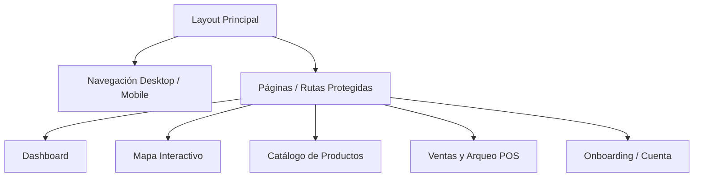

# Reporte de Diseño UI/UX y Arquitectura Frontend - KioskStar

Este reporte detalla el diseño, la usabilidad (UX), la interfaz de usuario (UI) y las decisiones técnicas implementadas en el frontend de **KioskStar** (una plataforma inteligente de gestión de redes de kioscos). Este documento sirve como material de soporte y presentación del sistema visual y de experiencia de usuario de la plataforma.

---

## 1. Stack Tecnológico del Frontend

El frontend de KioskStar está construido sobre tecnologías modernas que garantizan un rendimiento óptimo, tipado estricto y una interfaz responsiva y fluida:

*   **Núcleo de la Aplicación:** [React 19](https://react.dev/) y [TypeScript](https://www.typescriptlang.org/) para el desarrollo de componentes reutilizables con tipado estricto de datos.
*   **Herramienta de Construcción (Bundler):** [Vite 8](https://vite.dev/) para recargas rápidas en desarrollo y empaquetado optimizado en producción.
*   **Sistema de Estilos:** [Tailwind CSS v4](https://tailwindcss.com/) para una estilización rápida, limpia y basada en variables de diseño unificadas.
*   **Gestión del Estado Global:** [Redux Toolkit](https://redux-toolkit.js.org/) (`@reduxjs/toolkit`) y `react-redux` para manejar la autenticación, sucursales seleccionadas, inventario y sesiones activas.
*   **Motor de Animaciones:** [Framer Motion 12](https://www.framer.com/motion/) para transiciones físicas fluidas, efectos de deslizamiento, animaciones de entrada/salida y físicas elásticas.
*   **Iconografía:** [Lucide React](https://lucide.dev/) para iconos vectoriales SVG consistentes y ligeros.
*   **Integración de Mapas:** `@vis.gl/react-google-maps` para renderizar mapas interactivos de Google Maps de alto rendimiento.
*   **Cliente HTTP:** `Axios` para realizar peticiones asíncronas seguras hacia el backend de Node.js/Express.

---

## 2. Decisiones de Diseño de Interfaz (UI) y Sistema Visual

El sistema visual de KioskStar sigue las mejores prácticas modernas de diseño con una identidad propia basada en colores cálidos y contrastantes:

*   **Paleta de Colores Curada:** Se utiliza una base limpia de fondos blancos y grises de alta fidelidad (`--color-surface-*`), combinada con un degradado dinámico de naranja a índigo (`from-orange-700 via-orange-500 to-orange-700`) para elementos destacados, estados activos y botones de acción principal (`.gradient-primary` en [index.css](file:///C:/Users/Felipe/Documents/IDEAS/Kioskstar-TPFINAL/frontend/src/index.css)).
*   **Tipografía Inter y Outfit:** Utiliza fuentes Sans-Serif modernas de Google Fonts cargadas de forma nativa para lograr un aspecto limpio, tipográfico y minimalista que evita la fatiga visual.
*   **Micro-animaciones de Interacción:** Todos los elementos clickeables poseen transiciones al pasar el mouse (hover) y al presionarse (active), dando una respuesta inmediata (feedback táctil visual) que mejora la experiencia de uso.



---

## 3. Desglose Detallado de Pantallas e Interacciones UI/UX (con Código)

### 3.1. Cálculo de Distancia Cliente-Kiosco (Backend vs Local vs Google API)
*   **Objetivo de Usabilidad (UX):** Ofrecer al usuario un ordenamiento rápido de sucursales según su ubicación física, informando la distancia exacta en línea recta de forma instantánea.
*   **Explicación del Flujo:**
    1. **Geolocalización del Cliente:** La obtención de coordenadas ocurre en local mediante la API de Geolocalización del Navegador en el frontend en [MapView.tsx:L120-156](file:///C:/Users/Felipe/Documents/IDEAS/Kioskstar-TPFINAL/frontend/src/pages/MapView.tsx#L120-L156).
    2. **Cálculo en el Servidor (Backend):** Para optimizar recursos y evitar el cobro excesivo de APIs externas de Google, **el cálculo de la distancia no se hace en la API de Google ni en local**. Se ejecuta directamente en el **servidor backend** en memoria sobre el listado de sucursales de la base de datos usando la **Fórmula de Haversine**. 
    3. **Ordenamiento de Resultados:** El backend recibe la latitud/longitud del usuario por query params, calcula la distancia en kilómetros a cada sucursal y retorna el listado de sucursales ordenadas de la más cercana a la más lejana.
    4. **Cálculo de Ruta Peatonal (API de Google):** Solo cuando el usuario selecciona una sucursal y solicita la ruta (de forma manual o automática), la aplicación invoca la API `DirectionsService` de Google en el frontend para trazar el camino real sobre las calles y obtener la duración de caminata (ver sección 3.3).

#### Código del Cálculo en el Servidor (Haversine):
Ubicado en [maps.service.ts:L38-45](file:///C:/Users/Felipe/Documents/IDEAS/Kioskstar-TPFINAL/backend/src/services/maps.service.ts#L38-L45):
```typescript
export const calculateDistance = (lat1: number, lng1: number, lat2: number, lng2: number): number => {
  const R = 6371; // Radio de la Tierra en km
  const dLat = ((lat2 - lat1) * Math.PI) / 180;
  const dLng = ((lng2 - lng1) * Math.PI) / 180;
  const a = 
    Math.sin(dLat / 2) ** 2 + 
    Math.cos((lat1 * Math.PI) / 180) * Math.cos((lat2 * Math.PI) / 180) * 
    Math.sin(dLng / 2) ** 2;
  const c = 2 * Math.atan2(Math.sqrt(a), Math.sqrt(1 - a));
  return R * c; // Retorna la distancia en kilómetros
};
```

Uso en el controlador de búsqueda en el mapa en [map.controller.ts:L52-59](file:///C:/Users/Felipe/Documents/IDEAS/Kioskstar-TPFINAL/backend/src/controllers/map.controller.ts#L52-L59):
```typescript
// Ordenar por distancia usando la fórmula Haversine en memoria
const results = stockEntries.map((s) => {
  const dLat = ((s.branch.lat - userLat) * Math.PI) / 180;
  const dLng = ((s.branch.lng - userLng) * Math.PI) / 180;
  const a = Math.sin(dLat / 2) ** 2 + Math.cos((userLat * Math.PI) / 180) * Math.cos((s.branch.lat * Math.PI) / 180) * Math.sin(dLng / 2) ** 2;
  const c = 2 * Math.atan2(Math.sqrt(a), Math.sqrt(1 - a));
  return { ...s, distance: 6371 * c };
}).sort((a, b) => a.distance - b.distance);
```

---

### 3.2. Las "Orejitas" de Navegación Lateral (Edge Nudges)
*   **Objetivo de Usabilidad (UX):** Proveer una forma fluida e intuitiva de pasar de pantalla (pestana) sin necesidad de subir la vista hacia el Navbar superior, promoviendo una experiencia táctil elástica.
*   **Implementación UI:**
    *   Se definen dos botones invisibles de ancho de 48px situados a la izquierda y derecha de la pantalla de forma absoluta.
    *   Al pasar el puntero sobre una orejita, se muestra un haz de luz vertical en degradado naranja con sombra difuminada neón (`shadow-[0_0_10px_rgba(249,115,22,0.6)]`).
    *   El contenedor principal del contenido (`<motion.main>`) reacciona al estado de hover aplicando un empuje físico elástico de `8px` (`x: 8` o `-8`) en la dirección correspondiente mediante físicas de resorte.

#### Código de las Orejitas:
Ubicado en [Layout.tsx:L320-356](file:///C:/Users/Felipe/Documents/IDEAS/Kioskstar-TPFINAL/frontend/src/components/Layout.tsx#L320-L356):
```tsx
// Layout.tsx - Renderizado de las orejitas y contenedor con animación reactiva
return (
  <div className="flex-1 flex relative overflow-hidden">
    {prevPage && (
      <button
        onClick={() => navigate(prevPage.to)}
        onMouseEnter={() => setNudge('right')}
        onMouseLeave={() => setNudge(null)}
        className="absolute left-0 top-0 bottom-0 w-12 z-30 group cursor-pointer flex items-center justify-start focus:outline-none select-none"
      >
        <div className="absolute left-0 top-0 bottom-0 w-1 bg-gradient-to-b from-orange-700 via-orange-500 to-orange-700 opacity-0 group-hover:opacity-100 transition-all duration-300 translate-x-[-4px] group-hover:translate-x-0 shadow-[0_0_10px_rgba(249,115,22,0.6)]" />
      </button>
    )}

    {nextPage && (
      <button
        onClick={() => navigate(nextPage.to)}
        onMouseEnter={() => setNudge('left')}
        onMouseLeave={() => setNudge(null)}
        className="absolute right-0 top-0 bottom-0 w-12 z-30 group cursor-pointer flex items-center justify-end focus:outline-none select-none"
      >
        <div className="absolute right-0 top-0 bottom-0 w-1 bg-gradient-to-b from-orange-700 via-orange-500 to-orange-700 opacity-0 group-hover:opacity-100 transition-all duration-300 translate-x-[4px] group-hover:translate-x-0 shadow-[0_0_10px_rgba(249,115,22,0.6)]" />
      </button>
    )}

    <motion.main
      animate={{ x: nudge === 'right' ? 8 : nudge === 'left' ? -8 : 0 }}
      transition={{ type: 'spring', stiffness: 220, damping: 18 }}
      className="flex-1 p-4 lg:p-6 w-full overflow-y-auto"
    >
      <Outlet />
    </motion.main>
  </div>
);
```

---

### 3.3. Animaciones de la Barra de Navegación (Shared Layout Tabs)
*   **Objetivo de Usabilidad (UX):** Resaltar la pestaña en la que se encuentra posicionado el usuario, creando una transición suave que conecte las distintas secciones lógicas en lugar de un salto abrupto de color.
*   **Implementación UI:**
    *   Se utiliza el motor de Framer Motion compartiendo un mismo `layoutId="active-nav-tab"` en el elemento indicador activo.
    *   Framer Motion detecta cuando el elemento se monta en una nueva ruta y desmonta en la anterior, calculando la física para estirar y desplazar el fondo naranja de manera fluida y elástica (`spring` con `bounce: 0.32`).

#### Código del Slider de Navegación:
Ubicado en [Layout.tsx:L124-149](file:///C:/Users/Felipe/Documents/IDEAS/Kioskstar-TPFINAL/frontend/src/components/Layout.tsx#L124-L149):
```tsx
// Layout.tsx - El indicador naranja se desplaza físicamente al conmutar el enlace activo
<nav className="hidden lg:flex items-center gap-2 relative">
  {filteredNav.map((item) => (
    <NavLink
      key={item.to}
      to={item.to}
      className={({ isActive }) =>
        `relative px-4 py-2 text-sm transition-colors duration-300 rounded-full select-none
        ${isActive ? 'font-bold text-white z-10' : 'font-medium text-surface-500 hover:text-orange-600 hover:bg-surface-100'}`
      }
    >
      {({ isActive }) => (
        <>
          {isActive && (
            <motion.div
              layoutId="active-nav-tab" // Conector de Layout Compartido
              className="absolute inset-0 bg-gradient-to-r from-orange-700 via-orange-500 to-orange-700 border border-orange-800/80 rounded-full -z-10 shadow-lg shadow-orange-500/30"
              transition={{ type: 'spring', bounce: 0.32, duration: 0.45 }}
            />
          )}
          {item.label}
        </>
      )}
    </NavLink>
  ))}
</nav>
```

---

### 3.4. Implementación de Diálogos Modales con Portales (React Portals)
*   **Objetivo de Usabilidad (UX):** Focalizar la atención del usuario en un diálogo de confirmación o un formulario de alta/edición, aislando la interacción del resto de la página y evitando superposiciones de capas (z-index rotos).
*   **Implementación UI:**
    *   Uso de `createPortal` de `react-dom` para inyectar físicamente los componentes al final del `<body>` del documento.
    *   Se utiliza un fondo oscuro translúcido (`bg-black/50`) y animaciones elásticas rápidas (`animate-scale-in` y `animate-fade-in-up` definidas en CSS) al montarse el componente modal.
    *   Permite cerrar al hacer clic en el backdrop deteniendo la propagación en el modal (`e.stopPropagation()`).

#### Código del Modal de Producto:
Ubicado en [Products.tsx:L271-333](file:///C:/Users/Felipe/Documents/IDEAS/Kioskstar-TPFINAL/frontend/src/pages/Products.tsx#L271-L333):
```tsx
// Products.tsx - Inyección del diálogo de edición de productos al body
{showForm && createPortal(
  <div className="fixed inset-0 z-50 flex items-center justify-center bg-black/50 px-4" onClick={() => resetForm()}>
    <div
      className="bg-white rounded-2xl p-6 w-full max-w-lg shadow-2xl animate-fade-in-up"
      onClick={(e) => e.stopPropagation()} // Evita cerrar al hacer clic dentro
      role="dialog"
    >
      <h3 className="text-lg font-semibold mb-4">
        {editingId ? 'Editar Producto' : 'Nuevo Producto'}
      </h3>
      <form onSubmit={handleSubmit} className="space-y-4">
        {/* Campos del formulario */}
        <div className="flex gap-3 pt-2">
          <button type="button" onClick={resetForm} className="flex-1 py-2.5 rounded-xl border border-surface-200 ...">
            Cancelar
          </button>
          <button type="submit" className="flex-1 py-2.5 rounded-xl gradient-primary text-white font-medium ...">
            Guardar
          </button>
        </div>
      </form>
    </div>
  </div>,
  document.body // Inyección al final de la página
)}
```

---

### 3.5. Splash Screen Cinematográfico y Portal de Transición
*   **Objetivo de Usabilidad (UX):** Crear un impacto visual memorable y premium al ingresar a la plataforma, enmascarando los tiempos de carga iniciales y validación de tokens de sesión con una transición en forma de "túnel".
*   **Implementación UI/UX:**
    *   **Contorno Dibujado Progresivo:** Un SVG de estrella que utiliza la prop `pathLength` de Framer Motion para realizar un efecto de trazado en contorno neón desde `0` a `1` durante `1.3 segundos`.
    *   **Relleno Suave:** Tras trazarse el contorno, se realiza un fundido de relleno con el degradado de marca y una luz difusa detrás.
    *   **Efecto Portal de Salida:** Al finalizar la carga, la estrella se expande drásticamente (`scale: 18`, `rotate: 15`, `opacity: 0`) barriendo la pantalla para revelar el Dashboard en el fondo.
    *   **Sincronización:** Evita parpadeos coordinándose con el estado global de Redux (`welcomeSplashActive`).

#### Código del Splashscreen de Entrada:
Ubicado en [Login.tsx:L205-252](file:///C:/Users/Felipe/Documents/IDEAS/Kioskstar-TPFINAL/frontend/src/pages/Login.tsx#L205-L252):
```tsx
// Login.tsx - SVG de la estrella gigante con trazado secuencial y portal de salida
<motion.div
  animate={splashFadeOut ? { scale: 18, rotate: 15, opacity: 0 } : { scale: [1, 1.03, 1] }}
  transition={
    splashFadeOut 
      ? { type: 'spring', stiffness: 100, damping: 15 } 
      : { repeat: Infinity, duration: 2.2, ease: 'easeInOut' }
  }
  className="flex flex-col items-center justify-center relative"
>
  <svg viewBox="0 0 24 24" className="w-44 h-44 md:w-56 md:h-56 filter drop-shadow-[0_0_25px_rgba(249,115,22,0.65)]" fill="none">
    <motion.path
      d="M12 .587l3.668 7.431 8.2 1.192-5.934 5.787 1.4 8.168L12 18.896l-7.334 3.857 1.4-8.168L.132 9.21l8.2-1.192L12 .587z"
      stroke="url(#neon-stroke-gradient)"
      strokeWidth="0.8"
      strokeLinecap="round"
      strokeLinejoin="round"
      initial={{ pathLength: 0, fill: "rgba(249, 115, 22, 0)", fillOpacity: 0 }}
      animate={{ 
        pathLength: 1, 
        fill: "url(#neon-star-gradient)",
        fillOpacity: 1
      }}
      transition={{
        pathLength: { duration: 1.3, ease: "easeInOut" },
        fillOpacity: { delay: 1.2, duration: 0.6, ease: "easeIn" },
        fill: { delay: 1.2, duration: 0.6 }
      }}
    />
  </svg>
  <motion.h1 initial={{ opacity: 0 }} animate={{ opacity: 1 }} transition={{ delay: 1.4 }} className="text-4xl font-extrabold mt-6">
    Kiosk<span className="bg-clip-text text-transparent bg-gradient-to-r from-orange-500 to-amber-500">Star</span>
  </motion.h1>
</motion.div>
```

---

### 3.6. Flujo de Onboarding Inmersivo Paso a Paso
*   **Objetivo de Usabilidad (UX):** Guiar de manera amigable y libre de distracciones al nuevo usuario (comerciante o empleado) en la carga de sus datos de negocio principales.
*   **Implementación UI/UX:**
    *   Se bloquea el scroll y se oculta el cursor excedente con `h-screen w-screen overflow-hidden`.
    *   **Orbes Flotantes de Fondo:** Tres círculos de color difuminados con animación infinita `.animate-float` simulan profundidad de campo (profundidad tridimensional).
    *   **Tarjeta Esmerilada (Glassmorphism):** El contenedor posee la clase `.glass` que usa `backdrop-filter: blur(20px)` y bordes semi-transparentes para integrarse al fondo.
    *   **Barra de Progreso Reactiva:** Un componente dinámico calcula la posición del step actual dentro del arreglo para ajustar el ancho del indicador con transiciones de suavizado.

#### Código del Contenedor de Onboarding:
Ubicado en [Onboarding.tsx:L123-155](file:///C:/Users/Felipe/Documents/IDEAS/Kioskstar-TPFINAL/frontend/src/pages/Onboarding.tsx#L123-L155):
```tsx
// Onboarding.tsx - Orbes de fondo, barra de progreso y tarjeta glassmorphism
return (
  <div className="h-screen w-screen flex items-center justify-center gradient-hero relative overflow-hidden">
    {/* Orbes flotantes */}
    <div className="absolute top-20 right-10 w-72 h-72 bg-primary-500/10 rounded-full blur-3xl animate-float" />
    <div className="absolute bottom-20 left-10 w-96 h-96 bg-primary-400/8 rounded-full blur-3xl animate-float delay-3" />

    <div className="flex-1 flex items-center justify-center px-6 py-6 relative z-10 h-full overflow-hidden">
      <div className="w-full max-w-lg my-auto">
        {/* Barra de progreso */}
        <div className="w-full max-w-md mx-auto mb-5">
          <div className="h-1.5 bg-white/10 rounded-full overflow-hidden">
            <div className="h-full gradient-primary rounded-full transition-all duration-500" style={{ width: `${progress}%` }} />
          </div>
        </div>

        {/* Tarjeta Glassmorphic */}
        <div className="glass rounded-3xl shadow-2xl animate-scale-in max-h-[75vh] flex flex-col overflow-y-auto" style={{ padding: '1.5rem 2rem' }} key={`card-${step}`}>
          {/* Contenido dinámico del Step */}
        </div>
      </div>
    </div>
  </div>
);
```

---

### 3.7. Panel de Arqueo Físico Guiado (Botonera de Denominaciones)
*   **Objetivo de Usabilidad (UX):** Reducir a cero los errores humanos de tipeo y cálculo mental que realizan los cajeros al cerrar la caja del día.
*   **Implementación UI/UX:**
    *   En lugar de un campo de texto plano, se despliega una grilla táctil con las denominaciones oficiales de billetes vigentes.
    *   A medida que el cajero introduce la cantidad física contada de cada denominación, el sistema calcula de forma reactiva en memoria el subtotal de cada billete (`count * denom`).
    *   Muestra en tiempo real la conciliación: compara el **Total Contado** (`computedActualBalance`) contra el **Efectivo Esperado** (`expectedBalance`) y expone la diferencia final (sobrante en verde o faltante en rojo con el signo negativo).

#### Código del Panel de Arqueo y Conciliación:
Ubicado en [Sales.tsx:L604-657](file:///C:/Users/Felipe/Documents/IDEAS/Kioskstar-TPFINAL/frontend/src/pages/Sales.tsx#L604-L657):
```tsx
// Sales.tsx - Panel interactivo de arqueo por denominación de billete
<div className="grid grid-cols-1 gap-2 max-h-[450px] overflow-y-auto pr-2 custom-scrollbar">
  {DENOMINATIONS.map((denom) => {
    const count = parseInt(billCounts[denom]) || 0;
    const subtotal = count * denom;
    return (
      <div key={denom} className="flex items-center justify-between p-3 rounded-xl bg-surface-50/50 border border-surface-150 ...">
        <span className="text-sm font-bold text-surface-800 w-24">${denom.toLocaleString()}</span>
        <input
          type="number"
          min="0"
          value={billCounts[denom]}
          onChange={(e) => setBillCounts(prev => ({ ...prev, [denom]: e.target.value }))}
          placeholder="0"
          className="w-24 text-center px-3 py-1.5 rounded-lg border font-bold text-sm outline-none focus:ring-2 focus:ring-primary-500"
        />
        <span className="text-sm font-bold text-surface-700 text-right w-28">${subtotal.toLocaleString()}</span>
      </div>
    );
  })}
</div>

// Caja lateral de Conciliación
<div className="bg-surface-50/50 border border-surface-200/50 p-5 rounded-2xl space-y-4">
  <div className="flex justify-between font-semibold text-surface-500">
    <span>Efectivo Esperado</span>
    <span className="text-surface-700 font-bold">${expectedBalance.toFixed(2)}</span>
  </div>
  <div className="flex justify-between font-extrabold text-surface-950 text-sm">
    <span>Total Contado</span>
    <span className="text-primary-600">${computedActualBalance.toLocaleString()}</span>
  </div>
  <div className="flex justify-between font-semibold text-surface-500">
    <span>Diferencia</span>
    <span className={`font-bold ${computedActualBalance - expectedBalance >= 0 ? 'text-green-600' : 'text-red-600'}`}>
      ${(computedActualBalance - expectedBalance).toFixed(2)}
    </span>
  </div>
</div>
```

---

## 4. Otras Características Avanzadas de Experiencia de Usuario (UI/UX)

### 4.1. Debouncing en Búsquedas (Search-as-you-type)
Para prevenir saturar el backend con peticiones HTTP en cada pulsación de tecla durante la búsqueda de productos en el mapa, se implementa un debouncing de `400ms`. Si el usuario deja de escribir por este lapso, se dispara la consulta.
*   **Código:** [MapView.tsx:L214-220](file:///C:/Users/Felipe/Documents/IDEAS/Kioskstar-TPFINAL/frontend/src/pages/MapView.tsx#L214-L220)
```typescript
useEffect(() => {
  const delayDebounceFn = setTimeout(() => {
    performSearch(search);
  }, 400); // Espera 400ms
  return () => clearTimeout(delayDebounceFn);
}, [search, performSearch]);
```

### 4.2. Aura de Calor de Kiosco Destacado (Flame Aura)
La sucursal más cercana con stock se distingue con un marcador especial y un halo radiado de pulsos infinitos para guiar visualmente de manera instintiva al usuario.
*   **Código:** [MapView.tsx:L436-454](file:///C:/Users/Felipe/Documents/IDEAS/Kioskstar-TPFINAL/frontend/src/pages/MapView.tsx#L436-L454)
```tsx
<div className="relative flex items-center justify-center">
  {/* Halo pulsante simulando calor */}
  <div className="absolute w-16 h-16 rounded-full animate-pulse"
    style={{
      background: 'radial-gradient(circle, rgba(255,100,0,0.4) 0%, rgba(255,60,0,0.2) 40%, rgba(255,0,0,0.1) 70%, transparent 100%)',
      filter: 'blur(4px)',
    }} />
  <div className="absolute w-12 h-12 rounded-full animate-ping opacity-30"
    style={{ background: 'radial-gradient(circle, rgba(255,165,0,0.6) 0%, transparent 70%)' }} />
  <div className="relative flex items-center gap-1 px-3 py-1.5 rounded-full text-xs font-bold"
    style={{
      background: 'linear-gradient(135deg, #ff6a00, #ee0979)',
      color: 'white',
      boxShadow: '0 0 20px rgba(255,100,0,0.5)',
    }}>
    <Flame size={12} className="text-white fill-white inline shrink-0" /> {b.kiosk?.name || b.name}
  </div>
</div>
```

### 4.3. Lista Lateral con Animaciones Escalonadas (Staggered Children)
La barra lateral del mapa escala progresivamente los ítems de las sucursales al cargarse utilizando transiciones escalonadas que incrementan la percepción de fluidez en la interfaz.
*   **Código de Variables:** [MapView.tsx:L9-30](file:///C:/Users/Felipe/Documents/IDEAS/Kioskstar-TPFINAL/frontend/src/pages/MapView.tsx#L9-L30)
*   **Código del Mapeo:** [MapView.tsx:L530-591](file:///C:/Users/Felipe/Documents/IDEAS/Kioskstar-TPFINAL/frontend/src/pages/MapView.tsx#L530-L591)
```typescript
const containerVariants: Variants = {
  hidden: { opacity: 0 },
  show: {
    opacity: 1,
    transition: { staggerChildren: 0.05 }, // Retardo escalonado de 50ms por hijo
  },
};

const itemVariants: Variants = {
  hidden: { opacity: 0, y: 15 },
  show: {
    opacity: 1,
    y: 0,
    transition: { type: 'spring', stiffness: 100, damping: 15 },
  },
};
```

---

## 5. Resumen de Archivos UI/UX Modificados y Creados

A continuación, se listan los accesos directos a los archivos implicados en el diseño y usabilidad de KioskStar para su inspección directa en el IDE:

1.  **Estilos Globales y Animaciones CSS:** [index.css](file:///C:/Users/Felipe/Documents/IDEAS/Kioskstar-TPFINAL/frontend/src/index.css)
2.  **Layout General y Controles de Orejitas:** [Layout.tsx](file:///C:/Users/Felipe/Documents/IDEAS/Kioskstar-TPFINAL/frontend/src/components/Layout.tsx)
3.  **Inicio de Sesión y Welcome Splash Screen:** [Login.tsx](file:///C:/Users/Felipe/Documents/IDEAS/Kioskstar-TPFINAL/frontend/src/pages/Login.tsx)
4.  **Registro y Formularios:** [Register.tsx](file:///C:/Users/Felipe/Documents/IDEAS/Kioskstar-TPFINAL/frontend/src/pages/Register.tsx)
5.  **Dashboard con KPIs y Gráficos SVG:** [Dashboard.tsx](file:///C:/Users/Felipe/Documents/IDEAS/Kioskstar-TPFINAL/frontend/src/pages/Dashboard.tsx)
6.  **Buscador, Auras y Mapa Interactivo:** [MapView.tsx](file:///C:/Users/Felipe/Documents/IDEAS/Kioskstar-TPFINAL/frontend/src/pages/MapView.tsx)
7.  **Componente de Trazado de Caminata:** [Directions.tsx](file:///C:/Users/Felipe/Documents/IDEAS/Kioskstar-TPFINAL/frontend/src/components/Directions.tsx)
8.  **Modales y Catálogo de Productos:** [Products.tsx](file:///C:/Users/Felipe/Documents/IDEAS/Kioskstar-TPFINAL/frontend/src/pages/Products.tsx)
9.  **POS, Cierre de Caja y Planilla de Arqueo:** [Sales.tsx](file:///C:/Users/Felipe/Documents/IDEAS/Kioskstar-TPFINAL/frontend/src/pages/Sales.tsx)
10. **Diseño de Flujo de Onboarding:** [Onboarding.tsx](file:///C:/Users/Felipe/Documents/IDEAS/Kioskstar-TPFINAL/frontend/src/pages/Onboarding.tsx)
