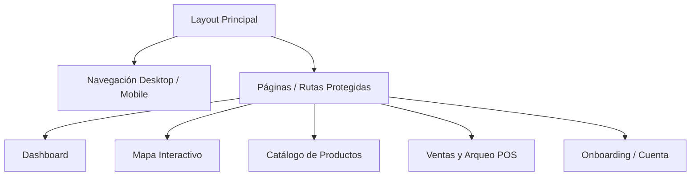

# Reporte de Diseño UI/UX y Arquitectura Frontend - KioskStar

Este reporte detalla el diseño, la usabilidad (UX), la interfaz de usuario (UI) y las decisiones técnicas implementadas en el frontend de **KioskStar** (una plataforma inteligente de gestión de redes de kioscos). Este documento está estructurado para servir como material de soporte y presentación ante evaluadores académicos.

---

## 1. Stack Tecnológico del Frontend

El frontend de KioskStar está construido sobre tecnologías modernas que garantizan un rendimiento óptimo, tipado estricto y una interfaz responsiva y fluida:

*   **Núcleo de la Aplicación:** [React 19](https://react.dev/) y [TypeScript](https://www.typescriptlang.org/) para el desarrollo de componentes reutilizables con tipado estricto de datos.
*   **Herramienta de Construcción (Bundler):** [Vite 8](https://vite.dev/) para recargas rápidas en desarrollo y empaquetado optimizado en producción.
*   **Sistema de Estilos:** [Tailwind CSS v4](https://tailwindcss.com/) para una estilización rápida, limpia y basada en variables de diseño unificadas.
*   **Gestión del Estado Global:** [Redux Toolkit](https://redux-toolkit.js.org/) (`@reduxjs/toolkit`) y `react-redux` para manejar la autenticación, sucursales seleccionadas, inventario y sesiones activas.
*   **Motor de Animaciones:** [Framer Motion 12](https://www.framer.com/motion/) para transiciones físicas fluidas, efectos de deslizamiento, animaciones de entrada/salida y físicas elásticas.
*   **Iconografía:** [Lucide React](https://lucide.dev/) para iconos vectoriales SVG consistentes y ligeros.
*   **Integración de Mapas:** `@vis.gl/react-google-maps` para renderizar mapas interactivos de Google Maps de alto rendimiento.
*   **Cliente HTTP:** `Axios` para realizar peticiones asíncronas seguras hacia el backend de Node.js/Express.

---

## 2. Decisiones de Diseño de Interfaz (UI) y Sistema Visual

El sistema visual de KioskStar sigue las mejores prácticas modernas de diseño con una identidad propia basada en colores cálidos y contrastantes (branding de KioskStar):

*   **Paleta de Colores Curada:** Se utiliza una base limpia de fondos blancos y grises de alta fidelidad (`--color-surface-*`), combinada con un degradado dinámico de naranja a índigo (`from-orange-700 via-orange-500 to-orange-700`) para elementos destacados, estados activos y botones de acción principal (`.gradient-primary` en [index.css](file:///c:/Users/feliv/Documents/Kioskstar-TPFINAL/frontend/src/index.css)).
*   **Tipografía Inter y Outfit:** Utiliza fuentes Sans-Serif modernas de Google Fonts cargadas de forma nativa para lograr un aspecto limpio, tipográfico y minimalista que evita la fatiga visual.
*   **Micro-animaciones de Interacción:** Todos los elementos clickeables poseen transiciones al pasar el mouse (hover) y al presionarse (active), dando una respuesta inmediata (feedback táctil visual) que mejora la experiencia de uso.



---

## 3. Desglose Detallado de Pantallas e Interacciones UI/UX (con Código)

A continuación se detallan las pantallas clave del proyecto, sus objetivos de usabilidad, decisiones visuales y las referencias e implementaciones de código exactas:

### 3.1. Dashboard Híbrido de Control
*   **Objetivo de Usabilidad (UX):** Reducir la carga cognitiva al ingresar a la plataforma combinando indicadores de rendimiento básicos (KPIs) con accesos directos grandes a tareas prioritarias.
*   **Implementación UI:**
    *   **Tarjetas de KPIs** ([Dashboard.tsx:L251-282](file:///c:/Users/feliv/Documents/Kioskstar-TPFINAL/frontend/src/pages/Dashboard.tsx#L251-L282)): Tarjetas estilizadas que muestran el total de ingresos de hoy y alertan en rojo si hay productos sin stock.
    *   **Gráfico de Barras Relacional** ([Dashboard.tsx:L284-345](file:///c:/Users/feliv/Documents/Kioskstar-TPFINAL/frontend/src/pages/Dashboard.tsx#L284-L345)): Gráfico SVG reactivo que divide los ingresos en tres turnos (Mañana, Mediodía, Tarde/Noche).
    *   **Acciones Rápidas** ([Dashboard.tsx:L350-403](file:///c:/Users/feliv/Documents/Kioskstar-TPFINAL/frontend/src/pages/Dashboard.tsx#L350-L403)): Botonera grande "anti-errores" para facilitar la navegación rápida en pantallas móviles.

#### Código Destacado (Distribución de Ventas por Turnos):
```tsx
// Cálculo de porcentajes máximos para el escalado del gráfico de barras SVG
const maxVal = Math.max(timeOfDaySales.morning, timeOfDaySales.midday, timeOfDaySales.afternoon, 1);
const morningPct = (timeOfDaySales.morning / maxVal) * 100;
const middayPct = (timeOfDaySales.midday / maxVal) * 100;
const afternoonPct = (timeOfDaySales.afternoon / maxVal) * 100;

return (
  <div className="flex items-end gap-5 h-20 border-b border-surface-100 pb-1.5 px-3">
    <div className="flex-1 flex flex-col items-center gap-1">
      <div 
        className="w-full bg-indigo-100 hover:bg-indigo-200 rounded-t-md transition-all duration-500" 
        style={{ height: `${Math.max(morningPct, 5)}%` }}
        title={`Mañana: $${timeOfDaySales.morning}`}
      />
    </div>
    <div className="flex-1 flex flex-col items-center gap-1">
      <div 
        className="w-full bg-primary-500 rounded-t-md transition-all duration-500" 
        style={{ height: `${Math.max(middayPct, 5)}%` }}
        title={`Mediodía: $${timeOfDaySales.midday}`}
      />
    </div>
    {/* Barra Tarde/Noche en color índigo oscuro */}
  </div>
);
```

### 3.2. Mapa de Sucursales Interactivo con Buscador al Vuelo e Interacciones Físicas
*   **Objetivo de Usabilidad (UX):** Permitir a los usuarios localizar sucursales e inspeccionar el stock disponible interactuando de forma limpia e intuitiva en mapas sin perder de vista los marcadores seleccionados.
*   **Implementación UI/UX:**
    *   **Búsqueda al vuelo (Search-as-you-type)** ([MapView.tsx:L204-209](file:///c:/Users/feliv/Documents/Kioskstar-TPFINAL/frontend/src/pages/MapView.tsx#L204-L209)): Hook de efecto con debouncing de `400ms` para realizar peticiones filtradas en segundo plano según el usuario escribe.
    *   **Efecto Pan & Zoom Inteligente con Desplazamiento de Centro** ([MapView.tsx:L90-113](file:///c:/Users/feliv/Documents/Kioskstar-TPFINAL/frontend/src/pages/MapView.tsx#L90-L113)): Al hacer clic en un marcador, el mapa centra el marcador de manera suave con `panTo` y hace zoom a `16`, pero **aplica un offset de coordenadas** dependiente de la pantalla (Desktop o Mobile) para evitar que la tarjeta flotante de información oculte físicamente el pin en el viewport.
    *   **Tags Marcadores Reactivos** ([MapView.tsx:L411-419](file:///c:/Users/feliv/Documents/Kioskstar-TPFINAL/frontend/src/pages/MapView.tsx#L411-L419)): Los tags se agrandan suavemente al pasar el puntero (`hover:scale-110`). Si una sucursal es seleccionada, el tag cambia su color de fondo al degradado naranja/índigo de marca, expande su escala a `scale-110` permanentemente, ensancha sus bordes e incrementa la fuente a `font-extrabold` para diferenciarse visiblemente del resto.
    *   **Aura Luminosa de Sucursal Cercana** ([MapView.tsx:L391-410](file:///c:/Users/feliv/Documents/Kioskstar-TPFINAL/frontend/src/pages/MapView.tsx#L391-L410)): La sucursal más cercana al usuario destaca en el mapa con un halo radiado dinámico (`animate-pulse`) y una onda expansiva circular (`animate-ping`) simulando el calor de una "llama" naranja/rosa.
    *   **Marcador Pulsante del Usuario** ([MapView.tsx:L373-376](file:///c:/Users/feliv/Documents/Kioskstar-TPFINAL/frontend/src/pages/MapView.tsx#L373-L376)): Punto de localización GPS del usuario rodeado por un halo expansivo con animación de pulso (`animate-ping`).

#### Código Destacado (Cálculo de Desplazamiento del Centro y Zoom del Mapa):
```typescript
// MapView.tsx - Centrado suavizado con offsets para evitar solapamientos visuales
const selectBranchAndZoom = (b: MapBranch) => {
  if (selectedBranch?.id === b.id) {
    setSelectedBranch(null);
    if (mapRef.current) mapRef.current.setZoom(13); // Restablece zoom inicial
  } else {
    setSelectedBranch(b);
    const isLargeScreen = window.innerWidth >= 1024;
    if (mapRef.current) {
      // Si es pantalla grande desplaza el centro a la izquierda (longitud). Si es móvil, hacia abajo (latitud)
      const targetCenter = isLargeScreen
        ? { lat: b.lat, lng: b.lng - 0.0035 }
        : { lat: b.lat - 0.0018, lng: b.lng };

      mapRef.current.panTo(targetCenter); // Glide suave hacia el objetivo

      const currentZoom = mapRef.current.getZoom();
      if (currentZoom !== 16) {
        mapRef.current.setZoom(16); // Zoom cinematográfico a nivel de calle
      }
    }
  }
};
```

### 3.3. Barra de Navegación y Transición de Pestañas Deslizantes (Slider)
*   **Objetivo de Usabilidad (UX):** Crear transiciones físicas fluidas y visualmente atractivas al conmutar pestañas o secciones, reforzando la relación de vecindad de la información.
*   **Implementación UI:**
    *   **Slider en Navbar Desktop** ([Layout.tsx:L138-144](file:///c:/Users/feliv/Documents/Kioskstar-TPFINAL/frontend/src/components/Layout.tsx#L138-L144)): En lugar de un mero cambio instantáneo de color, se implementa una "burbuja" de degradado naranja. Al pulsar un link, la burbuja se desplaza físicamente deslizándose detrás del texto del enlace activo.
    *   **Slider en Pestañas POS** ([Sales.tsx:L277-283](file:///c:/Users/feliv/Documents/Kioskstar-TPFINAL/frontend/src/pages/Sales.tsx#L277-L283)): Las opciones de "Registrar Venta" e "Historial de Caja" comparten el mismo efecto de slider, dando un feedback visual unificado.
    *   **Estructuración Técnica (`layoutId`):** Se utiliza la propiedad `layoutId` de Framer Motion. Al compartir la misma clave ID en el árbol de React, Framer Motion calcula automáticamente la diferencia de rectángulos de layout y anima la transición posicional usando físicas de resorte (`spring` con `bounce: 0.32`).

#### Código Destacado (Pestañas Deslizantes en Navbar):
```tsx
// Layout.tsx - El contenedor animado se desliza automáticamente al cambiar el enlace activo
{filteredNav.map((item) => (
  <NavLink key={item.to} to={item.to} className="relative px-4 py-2 text-sm transition-colors duration-300 rounded-full">
    {({ isActive }) => (
      <>
        {isActive && (
          <motion.div
            layoutId="active-nav-tab" // Enlaza posicionalmente la burbuja activa
            className="absolute inset-0 bg-gradient-to-r from-orange-700 via-orange-500 to-orange-700 border border-orange-800/80 rounded-full -z-10 shadow-lg shadow-orange-500/30"
            transition={{ type: 'spring', bounce: 0.32, duration: 0.45 }}
          />
        )}
        <span className={isActive ? "font-bold text-white z-10" : "font-medium text-surface-500"}>
          {item.label}
        </span>
      </>
    )}
  </NavLink>
))}
```

### 3.4. Catálogo de Productos y Clasificación en Kanban de Ranking
*   **Objetivo de Usabilidad (UX):** Buscar, clasificar y comparar el rendimiento de ventas de productos de manera eficiente.
*   **Implementación UI:**
    *   **Grid vs List View** ([Products.tsx:L22](file:///c:/Users/feliv/Documents/Kioskstar-TPFINAL/frontend/src/pages/Products.tsx#L22)): Estado reactivo `viewMode` que altera la maquetación a nivel del catálogo.
    *   **Kanban de Ranking por Ventas** ([Products.tsx:L473-530](file:///c:/Users/feliv/Documents/Kioskstar-TPFINAL/frontend/src/pages/Products.tsx#L473-L530)): Agrupación por categorías donde los productos se disponen verticalmente en columnas de rendimiento.
    *   **Portales Modal** ([Products.tsx:L271](file:///c:/Users/feliv/Documents/Kioskstar-TPFINAL/frontend/src/pages/Products.tsx#L271) y [Products.tsx:L336](file:///c:/Users/feliv/Documents/Kioskstar-TPFINAL/frontend/src/pages/Products.tsx#L336)): Renderizado mediante `createPortal` de React que traslada los diálogos de formulario de forma segura.

### 3.5. Terminal POS y Panel de Arqueo Físico Guiado
*   **Objetivo de Usabilidad (UX):** Agilizar la venta presencial en el local y evitar inconsistencias contables al cierre del turno.
*   **Implementación UI/UX:**
    *   **Carrito con Validaciones Dinámicas** ([Sales.tsx:L147-181](file:///c:/Users/feliv/Documents/Kioskstar-TPFINAL/frontend/src/pages/Sales.tsx#L147-L181)): Los límites de cantidades agregadas se comprueban directamente contra el array global de inventario de Redux en cada iteración de cantidad.
    *   **Planilla Física de Arqueo** ([Sales.tsx:L559-690](file:///c:/Users/feliv/Documents/Kioskstar-TPFINAL/frontend/src/pages/Sales.tsx#L559-L690)): Layout a pantalla completa que expone una botonera interactiva de denominaciones monetarias, calculando la diferencia y contrastando el saldo real contra el saldo esperado.

### 3.6. Flujo de Onboarding Centrado y Modular
*   **Objetivo de Usabilidad (UX):** Acompañar al nuevo usuario a través de los pasos de configuración inicial de manera rápida y sin elementos de distracción.
*   **Implementación UI/UX:**
    *   **Diseño Scrollbar-Free** ([Onboarding.tsx:L17](file:///c:/Users/feliv/Documents/Kioskstar-TPFINAL/frontend/src/pages/Onboarding.tsx#L17)): Bloqueo del viewport con `overflow-hidden` y centrado de la tarjeta mediante flexbox.
    *   **Estructura de Pasos (Step State)** ([Onboarding.tsx:L8](file:///c:/Users/feliv/Documents/Kioskstar-TPFINAL/frontend/src/pages/Onboarding.tsx#L8)): State modular que conmuta condicionalmente las pantallas.

### 3.7. Splash Screen de Entrada, Portal de Transición y "Orejas" Page Nudge
*   **Objetivo de Usabilidad (UX):** Incrementar la inmersión del usuario y proveer controles de navegación rápidos e intuitivos para desplazarse por la interfaz.
*   **Implementación UI:**
    *   **Welcome Splash Animado** ([Login.tsx:L183-254](file:///c:/Users/feliv/Documents/Kioskstar-TPFINAL/frontend/src/pages/Login.tsx#L183-L254)): Pantalla negra con iluminación de neón. Utiliza un SVG de estrella gigante que se autodibuja (`pathLength: 1`) y luego se rellena de color degradado y brillo naranja.
    *   **Portal Expansivo (Exit)** ([Login.tsx:L202-210](file:///c:/Users/feliv/Documents/Kioskstar-TPFINAL/frontend/src/pages/Login.tsx#L202-L210)): Al terminar el tiempo de carga, la estrella se expande drásticamente (`scale: 18`, `rotate: 15`), abriendo el Dashboard en pantalla en forma de túnel.
    *   **Orejas Edge Nudge** ([Layout.tsx:L321-353](file:///c:/Users/feliv/Documents/Kioskstar-TPFINAL/frontend/src/components/Layout.tsx#L321-L353)): Botones invisibles de 48px de ancho a los lados de la pantalla. Al pasar el mouse, revelan una delgada línea de degradado naranja con resplandor neón exterior (`shadow-[0_0_10px_rgba(249,115,22,0.6)]`) e inducen un leve empuje elástico lateral (`x: 8` o `-8`) en la pantalla de contenido.

#### Código Destacado (Estructura de Animación del Splashscreen y Portal):
```tsx
// Login.tsx - SVG de la estrella gigante con trazado secuencial y portal de salida
<motion.div
  animate={splashFadeOut ? { scale: 18, rotate: 15, opacity: 0 } : { scale: [1, 1.03, 1] }}
  transition={splashFadeOut ? { type: 'spring', stiffness: 100, damping: 15 } : { repeat: Infinity, duration: 2.2 }}
  className="flex flex-col items-center justify-center relative"
>
  <svg viewBox="0 0 24 24" className="w-44 h-44 md:w-56 md:h-56 filter drop-shadow-[0_0_25px_rgba(249,115,22,0.65)]">
    <motion.path
      d="M12 .587l3.668 7.431 8.2 1.192-5.934 5.787 1.4 8.168L12 18.896l-7.334 3.857 1.4-8.168L.132 9.21l8.2-1.192L12 .587z"
      stroke="url(#neon-stroke-gradient)"
      strokeWidth="0.8"
      initial={{ pathLength: 0, fillOpacity: 0 }}
      animate={{ pathLength: 1, fillOpacity: 1 }}
      transition={{
        pathLength: { duration: 1.3, ease: "easeInOut" },
        fillOpacity: { delay: 1.2, duration: 0.6, ease: "easeIn" }
      }}
    />
  </svg>
</motion.div>
```

---

## 4. Patrones de UX e Integridad de Datos en Frontend

*   **Redirección Controlada del Splash Screen** ([App.tsx:L40](file:///c:/Users/feliv/Documents/Kioskstar-TPFINAL/frontend/src/App.tsx#L40) y [Login.tsx:L25-32](file:///c:/Users/feliv/Documents/Kioskstar-TPFINAL/frontend/src/pages/Login.tsx#L25-L32)): Corregimos un bug clásico de enrutamiento en React donde la carga inmediata del token en Redux hacía que `<Navigate />` desmontara instantáneamente el componente `/login` hacia `/dashboard`, impidiendo que el Splash de bienvenida se mostrara. Introdujimos el flag `welcomeSplashActive` en Redux, el cual retiene el renderizado de Login temporalmente mientras las animaciones de Framer Motion se ejecutan, y se desactiva ordenadamente mediante `finishSplash()` al finalizar la cuenta regresiva para proceder con la navegación.
*   **Mitigación de Fuga de Información de Sesión (Logout State Flush)** ([store/index.ts:L13-L20](file:///c:/Users/feliv/Documents/Kioskstar-TPFINAL/frontend/src/store/index.ts#L13-L20)): Para cumplir con estrictos estándares de seguridad y privacidad, al detectarse la acción `'auth/logout'`, el reducer raíz redefine el estado de la aplicación a `undefined`, forzando a Redux a inicializar todos los almacenes de datos desde cero.

---

## 5. Resumen de Archivos UI/UX Modificados y Creados

A continuación, se listan los accesos directos a los archivos implicados en esta entrega para una rápida inspección:

1.  **Estilos Globales y Variables:** [index.css](file:///c:/Users/feliv/Documents/Kioskstar-TPFINAL/frontend/src/index.css)
2.  **Layout y Transiciones:** [Layout.tsx](file:///c:/Users/feliv/Documents/Kioskstar-TPFINAL/frontend/src/components/Layout.tsx)
3.  **Inicio de Sesión y Splash Screen:** [Login.tsx](file:///c:/Users/feliv/Documents/Kioskstar-TPFINAL/frontend/src/pages/Login.tsx)
4.  **Registro con Split-Panel:** [Register.tsx](file:///c:/Users/feliv/Documents/Kioskstar-TPFINAL/frontend/src/pages/Register.tsx)
5.  **Dashboard de Gestión:** [Dashboard.tsx](file:///c:/Users/feliv/Documents/Kioskstar-TPFINAL/frontend/src/pages/Dashboard.tsx)
6.  **Vista del Mapa Interactivo:** [MapView.tsx](file:///c:/Users/feliv/Documents/Kioskstar-TPFINAL/frontend/src/pages/MapView.tsx)
7.  **Catálogo de Productos y Clasificación:** [Products.tsx](file:///c:/Users/feliv/Documents/Kioskstar-TPFINAL/frontend/src/pages/Products.tsx)
8.  **POS, Cierre y Panel de Arqueo:** [Sales.tsx](file:///c:/Users/feliv/Documents/Kioskstar-TPFINAL/frontend/src/pages/Sales.tsx)
9.  **Store y Root Reducer:** [store/index.ts](file:///c:/Users/feliv/Documents/Kioskstar-TPFINAL/frontend/src/store/index.ts) y [cashSessionSlice.ts](file:///c:/Users/feliv/Documents/Kioskstar-TPFINAL/frontend/src/store/cashSessionSlice.ts)
10. **Flujo de Onboarding:** [Onboarding.tsx](file:///c:/Users/feliv/Documents/Kioskstar-TPFINAL/frontend/src/pages/Onboarding.tsx)
